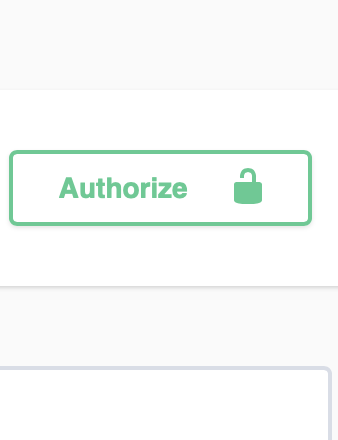
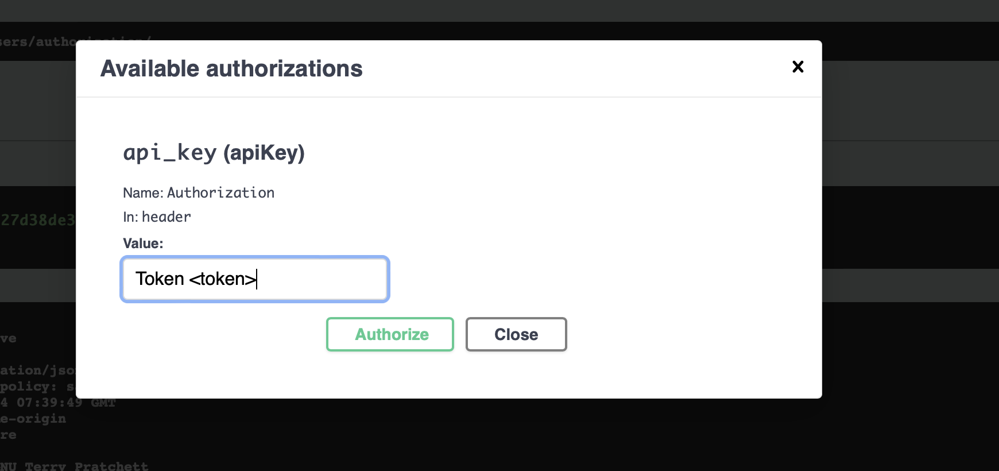

# Django Project

## This project is a web application based on Django Rest Framework.

### Instalation

``` bash
git clone https://github.com/Luba77/test_project_box
```

### Install and activate virtual env depends on your system
#### Example (windows system):
``` bash
pip install virtualenv
virtualenv venv
venv/Scripts/activate
```

### Next steps
``` bash
cd test_project_box
pip install -r requirements.txt
```

### Put secret key
in settings.py put SECRET KEY from credentials/settings.py

``` bash
python manage.py migrate
```

## Load fixtures :
``` bash
python3  manage.py loaddata boxes/fixtures/boxes_data.json
python3  manage.py loaddata boxes/fixtures/user_boxes_data.json
python3  manage.py loaddata notifications/fixtures/notifications_data.json
python3  manage.py loaddata notifications/fixtures/user_notificate_data.json
python3  manage.py loaddata operations/fixtures/coins_data.json
python3  manage.py loaddata operations/fixtures/balance_data.json
python3  manage.py loaddata operations/fixtures/operations_data.json 
```

## ACTUAL REALTIME LINK:

http://luba.pythonanywhere.com/swagger/


## MAIN STEPS:

### Register :
/users/registration/:
First, register by filling out the registration form on the website.

### Confirm verification code:
/users/confirm/

After registration, check your email inbox for a confirmation message.
Open the email and click on the confirmation link to verify your email address.
This will confirm your registration and activate your user account.

### Authorize to get Token:
/users/authorization/

Get the authentication token and enter it into the field:
After confirming your account, you need to obtain an authentication token to access certain features of the website.
Navigate to the authentication section of the website.

### Go to :


### Put token to auth :

where Token from /users/authorization/

## OR USE creds of  Users in db:
in /users/authorization/

``` bash
username : lu
password 12345

username : di
password 12345

username : vi
password 12345
```


